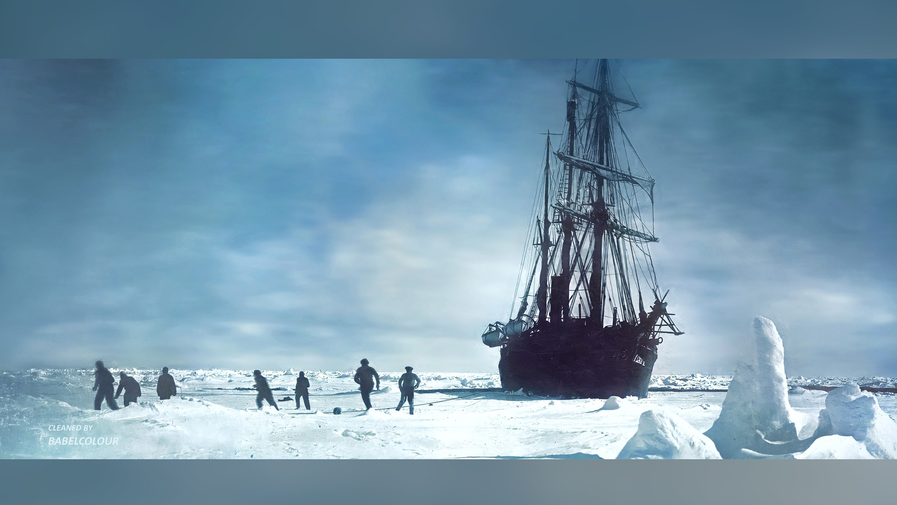

# Leadership
Leadership reading list

Leader's are going somewhere (vision). They have a goal in mind.

Diffirent leaders for different situations.

What makes a good leader?

- Someone who tells the truth (honesty).
- Someone who listens.
- Someone who identifies the right questions.
 

## Titles

- [How to Win Friends & Influence People](https://github.com/DavidGeeraerts/Leadership/blob/main/doc/How%20to%20Win%20Friends%20%26%20Influence%20People.md) -- [Dale Carnegie](https://en.wikipedia.org/wiki/Dale_Carnegie)
- Leaders Eat Last -- Simon Sinek
- Start with Why: How Great Leaders Inspire Everyone to Take Action -- Simon Sinek
- Learning to Lead -- Warren Bennis
- On Becoming a Leader -- Warren Bennis
- The Power Pradox -- Dacher Kellner
- Discipline Equals Freedom: Field Manual -- Jocko Willink
- Extreme Ownership -- Jocko Willink
- The Dichotomy of Leadership: Balancing the Challenges of Extreme Ownership to Lead and Win -- Jocko Willink
- Primed to Perform -- Neel Dosh
- Team of Teams -- Gen. Stanely McChrystal
- Team Genius -- Rich Karlgaard

## Off the beaten path

- The Scout Mindset: Why Some People See Things Clearly and Others Don't -- Julia Galef
- The Righteous Mind -- Jonathan Haidt
- How to Have Impossible Conversations -- Peter Boghossian
- On Becoming a Person -- Carl R Rogers
- 12 Rules for Life -- Jordan Peterson
- Beyond Order: 12 More Rules for Life -- Jordan Peterson
- Recapture the Rapture: Rethinking God, Sex, and Death in a World That's Lost Its Mind -- Jamie Wheal
- The Matter With Things: Our Brains, Our Delusions and the Unmaking of the World -- Iain McGilchrist
- The Happiness Hypothesis: Finding Modern Truth in Ancient Wisdom -- Jonathan Haidt
- Atomic Habits: An Easy & Proven Way to Build Good Habits & Break Bad Ones -- James Clear
- The Seven Habits of Highly Effective People -- Steven R. Covey
